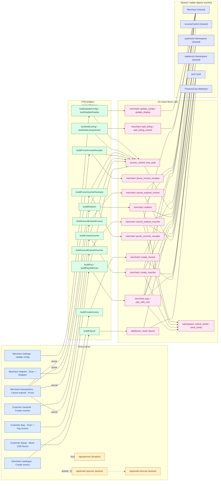

# Architecture

## What this dApp is

A **closed-loop payments + loyalty dApp** implemented in Move on Sui plus a
Next.js app. A single merchant issues on-chain invoices in a chosen stablecoin
and earns a soulbound loyalty token (`LOYALTY`) that customers later spend
back against catalog items. Customer, merchant, and payout addresses each hold
their assets in **PAS (Permissioned Asset Standard) accounts** — so the whole
system is a case study of how to build a real payments UX on top of the PAS
custody primitive.

The result behaves like a coffee-shop counter with two rails:

- **Invoice rail** — merchant creates an invoice at catalog-snapshotted terms,
  customer scans the QR and settles from their PAS account, receipt lands in
  the merchant's receipts table, `LOYALTY` is minted into the customer's
  account.
- **Voucher rail** — customer locks `LOYALTY` into a voucher (hashlock over a
  local preimage), the cashier scans a QR carrying `voucher_id + preimage`,
  the redeem tx checks the hash on chain and burns the locked balance.

## Core ideas

### 1. PAS-native custody for every party

Every settlement side keeps its balances in a PAS account, not as owned
`Coin<T>` objects on an EOA. Customers hold stablecoin + `LOYALTY` in their
own account, the payout address holds the merchant's stablecoin earnings, and
the merchant itself has an account for internal transfers. A stablecoin
payment moves funds via a PAS `send_funds` request gated by the stablecoin
policy's approval (the mock registers a permissive `TransferApproval`), while
voucher creation pulls `LOYALTY` out of the customer's account via an
`unlock_funds` request gated by `RedeemUnlockApproval` — soulbound tokens are
enforced by *not* registering `send_funds` for `LOYALTY`, so
account-to-account transfers of loyalty can never resolve.

### 2. Two settlement flows sharing one Merchant shared object

The `Merchant` shared object is the single source of truth. It stores the
catalog (`Listing`s and their `Variant`s), open `Invoice`s, open `Voucher`s,
and both settlement receipts (`Receipt<Payment>`, `Receipt<Redemption>`) in
`Table`s keyed by the originating invoice/voucher id. Neither `Invoice` nor
`Voucher` has `key` — they're `store`-only values inside their tables. This
means there is no per-user history object to look up: history is
reconstructed off the event stream and resolved through the merchant tables.

### 3. Hashlock voucher for offline scan-to-redeem

Vouchers are the security-sensitive rail. If a voucher were an owned object,
whoever holds the object could redeem it — so a phone that displays the QR
would effectively bearer-authenticate the redemption. Instead:

- The customer generates a random 32-byte preimage locally.
- The `Voucher` stored in `Merchant.vouchers` commits only its
  `blake2b256(preimage)`. The locked `Balance<LOYALTY>` is separated from
  authorization.
- The QR carries `{voucher_id, preimage}`. The cashier scans it, the client
  optionally hash-checks locally, then submits `redeem(voucher_id, preimage)`.
  On chain, `merchant::redeem` recomputes the hash, compares, and burns.

This means a photograph of the QR is enough to redeem — the QR itself is the
bearer credential. That's intentional: the model expects the customer to
show the QR only at the counter, and expiry (see below) bounds the exposure
window.

The **known limitation** here: because the preimage lives in the client's
`localStorage` keyed by `redeemHash`, clearing site data or switching devices
loses the redemption path. Only `cancel_expired_voucher` after expiry
recovers the locked balance in that case. See **Known limitations** below
for the cross-device follow-up option.

### 4. Access-control roles gate the admin surface

An `AccessControl<MERCHANT>` shared object (from `openzeppelin_access`) is
created in `merchant::init`. The `MERCHANT` OTW itself is the root role; the
deployer becomes its sole holder. Three operational roles split the admin
surface:

- **`MerchantRole`** — identity + treasury settings
  (`update_config`, `update_display`, receipt pruning) plus pre-expiry
  `cancel_invoice` / `cancel_voucher`. Payout address is rotated through
  `update_config`.
- **`CatalogManagerRole`** — catalog CRUD (`add_listing`,
  `add_listing_variant`, status toggle, remove).
- **`CashierRole`** — settlement (`create_invoice`, `redeem`).

`redeem` is gated by **both** `CashierRole` and the customer's preimage: the
till operator authorizes settlement, and the preimage proves the customer
revealed the secret committed at voucher creation — so `CashierRole` alone
can't sweep vouchers seen in public `VoucherCreated` events. Voucher creation
is customer-initiated and role-free. Cancellation post-expiry is permissionless
(see `cancel_expired_invoice` / `cancel_expired_voucher`); pre-expiry
cancellation is `MerchantRole`-gated.

### 5. Time comes from the on-chain Clock, not the wallclock

Invoice and voucher `expires_at_ms` are set on chain from `clock.timestamp_ms()`
(the shared `Clock` at `0x6`). Comparing them against the browser's
`Date.now()` is wrong whenever the two drift — most visibly on localnet,
where the on-chain clock only advances on checkpoints and can lag the
wallclock by many minutes if the node was paused. The `useSuiClockMs()` hook
reads `0x6` and polls every 5 s; every UI expiry check goes through it.

### 6. Sponsored transactions with a three-way branch

The `useSponsoredMutation` hook picks a signing path per (network, sender):

- **Localnet + non-deployer sender** → `/api/sponsor` (the deployer key
  pays gas). Customers and any extra cashier wallets granted `CashierRole`
  fall here — they get a fully-sponsored UX on localnet without holding
  SUI. Convenience only, never shipped to a live network.
- **Testnet + Enoki-registered wallet** → two-phase Enoki: `/api/enoki-sponsor`
  (`createSponsoredTransaction`) then `/api/enoki-execute`
  (`executeSponsoredTransaction`). The Enoki service pays gas; user signs the
  tx data separately.
- **Testnet + any other wallet, OR localnet + deployer sender** →
  `useSignAndExecuteTransaction` from dapp-kit. The wallet pays gas itself.
  The deployer wallet is bootstrap-funded on localnet, so it always has SUI
  to spend on its own txs; self-sponsorship would collide with the wallet's
  own gas-coin selection anyway.

In every branch the **sender** is the connected wallet, and Move sees
`ctx.sender()` = the customer/cashier. The sponsor pays gas and has no
authority over the tx's effects — they can't add move calls or swap
arguments. `NEXT_PUBLIC_DEPLOYER_ADDRESS` is written by bootstrap so the
client can detect deployer-sent txs and route them to the wallet-pays
path.

## Move module layout

```
contracts/payments/sources/
  config.move        Config: payout address, accepted payment TypeName + decimals,
                     loyalty coefficient, TTLs. Snapshotted onto each Invoice
                     at creation — a later update_config only binds future invoices.
  events.move        InvoiceCreated / InvoicePaid / InvoiceCanceled /
                     VoucherCreated / VoucherRedeemed / VoucherCanceled +
                     package-private emit helpers. Only signal for indexers.
  listing.move       Listing: menu entry with a map of priced Variants keyed
                     by auto-generated ID. Stored as values inside Merchant.listings.
  loyalty.move       LOYALTY OTW + Loyalty resource bundle. Soulbound:
                     RedeemUnlockApproval registered for unlock_funds,
                     send_funds NOT registered.
  merchant.move      Merchant (shared): catalog + open invoices + open vouchers
                     + both receipt tables + AccessControl<MERCHANT> hooks.
                     Owns all merchant-aware logic: pay, redeem, cancel*, prune*,
                     update_config, add/remove listing + variant.
  payment.move       Invoice data type + dumb new/unpack. No dependency on
                     merchant (would cycle since Merchant stores Table<ID, Invoice>).
  receipt.move       Receipt<T>, Payment, Redemption, Item, compute_total.
                     Stored in Merchant.invoice_receipts / voucher_receipts
                     keyed by originating invoice/voucher id.
  redemption.move    Voucher data type + dumb new/unpack. Same structure as
                     payment.move — merchant-aware logic lives in merchant.
```

## PTB flow

Every UI action funnels through the PTB builders in
[`app/src/lib/move`](../app/src/lib/move) and lands on a fixed set of Move
calls against the shared `Merchant`, the two PAS namespaces, and the on-chain
`Clock`:



> GitHub renders the diagram inline. In VS Code, install
> `bierner.markdown-mermaid` to see it in the built-in preview.

## Why these design choices

### Why receipts live on the Merchant, not owned by the customer

If receipts were owned by the customer, listing a user's history would need a
per-user index (an owned-object walk or an off-chain indexer). Storing them
keyed by originating invoice/voucher id inside the Merchant collapses the
model: the canonical record is the on-chain **event**, and the Merchant
tables are the value store the event points into. History reconstruction is
`events → filter by customer → resolve id via table` — one primitive with
no divergent state.

### Why hashlock voucher instead of an owned Voucher object

An owned `Voucher` would authenticate the redemption purely by ownership.
That works, but it forces the customer's wallet to be present at the counter
in a signing capacity — a photo of the QR would not suffice. The hashlock
model separates **authorization** (preimage possession) from **custody**
(the locked balance stays inside the Merchant table until burn), which lets
scan-to-redeem be a pure QR flow and lets the merchant hold the balance
until they physically hand over the goods.

### Why `cancel_expired_*` is permissionless

Expired vouchers hold locked `LOYALTY` that would otherwise be irretrievable
if only the merchant could clean them up. Making `cancel_expired_voucher`
permissionless lets anyone — including the customer themselves — reclaim the
balance back into the customer's PAS account after expiry. The pre-expiry
`cancel_voucher` is still `MerchantRole`-gated because it's a merchant
decision to void an outstanding voucher early.

### Why per-user history is a client-side event walk

The RPC's compound `{ All: [MoveEventType, MoveEventField] }` filter
returns "Invalid params" on public testnet fullnodes — the parser rejects
the compound form entirely. So server-side filtering by `/customer` isn't
viable. `useReceipts` fetches by event type only, filters by customer
client-side, and caps the page walk at `MAX_PAGES * 200 ≈ 1000` events. See
**Known limitations** for the scaling failure mode.

### Why the on-chain Clock, not `Date.now()`

Invoice / voucher `expires_at_ms` values are set from `clock.timestamp_ms()`
in the Move contracts, so any UI check like "is this expired yet?" must use
the same clock or it will disagree with what the chain enforces. On localnet
we've watched >40 minutes of skew accumulate; without the clock hook, freshly
created vouchers get marked expired on paint.

## Known limitations & follow-ups

### Voucher preimage is device-bound

The redemption preimage is generated client-side and stored in
`localStorage` keyed by `redeemHash`. **Clearing site data, using a private
window, or switching devices** loses the preimage, and with it the ability
to redeem the voucher — only `cancel_expired_voucher` after expiry recovers
the locked balance. This is a deliberate trade for the pure-QR redeem UX.

**Cross-device follow-up option (not implemented):** encrypt the preimage
to the customer's own address, hand the ciphertext to a backend keyed on
`customer_address + voucher_id`, and let the customer decrypt on any device
they can sign from. That reintroduces a server dependency but eliminates the
device-bound loss mode.

### Per-customer history has a global page cap

`useReceipts` walks up to 1000 most-recent `InvoicePaid` / `VoucherRedeemed`
events across **all** customers before filtering by the current customer. As
total on-chain volume grows past ~1000 events, older receipts for a given
customer silently fall outside the walked window — no error, no truncation
banner, just missing rows. A template deployment intended for real traffic
should be paired with an indexer that supports customer-scoped queries.

### `/api/topup` is an unauthenticated mock-USD faucet on testnet

The route is disabled on mainnet but open on testnet with no auth or
rate limit — deliberately, because the mock stablecoin is fake-money and the
faucet UX is the whole point of the demo. A real deployment against a
production stablecoin doesn't hold `TreasuryCap<C>` and can't call this path
at all; a public testnet deployment intended to survive spam should strip
the route or wire in its own gating.

### Localnet Enoki path is unsupported

Enoki's zkLogin prover runs on Mysten infra with a max-epoch-upper-bound
delta of 30. Localnet epoch 0 vs testnet-derived `maxEpoch` from a client ID
whose sessions target testnet puts the request outside that window. The
`useSponsoredMutation` hook routes localnet through the local gas station
instead; Enoki-based zkLogin only works on testnet/mainnet.

## Reference layout for code

| Concern | Location |
|---|---|
| Move sources | [contracts/payments/sources](../contracts/payments/sources) |
| PAS integration + auth builders | [app/src/lib/move/pas.ts](../app/src/lib/move/pas.ts), [app/src/lib/move/auth.ts](../app/src/lib/move/auth.ts) |
| PTB builders (one file per Move module) | [app/src/lib/move](../app/src/lib/move) |
| Move data-type parsers | [app/src/lib/move/types.ts](../app/src/lib/move/types.ts) |
| React Query hooks (reads) | [app/src/hooks/queries.ts](../app/src/hooks/queries.ts) |
| Sponsored-mutation dispatch | [app/src/hooks/use-sponsored-mutation.ts](../app/src/hooks/use-sponsored-mutation.ts) |
| On-chain Clock hook | [app/src/hooks/use-sui-clock.ts](../app/src/hooks/use-sui-clock.ts) |
| Sponsor + Enoki API routes | [app/src/app/api/sponsor](../app/src/app/api/sponsor), [app/src/app/api/enoki-sponsor](../app/src/app/api/enoki-sponsor), [app/src/app/api/enoki-execute](../app/src/app/api/enoki-execute) |
| Bootstrap / seed scripts | [app/scripts/bootstrap.ts](../app/scripts/bootstrap.ts), [app/scripts/seed.ts](../app/scripts/seed.ts) |

## Where to go next

- [Top-level README](../README.md) — Quickstart, env vars, `pnpm bootstrap` /
  `pnpm seed` flow.
- Move sources — start at [merchant.move](../contracts/payments/sources/merchant.move);
  the module docstring lays out the settlement surface, and every public
  function has an invariant-referencing doc comment.
