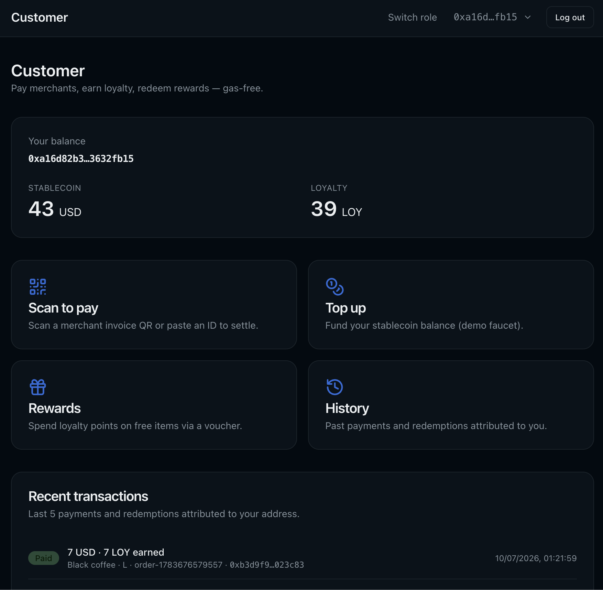
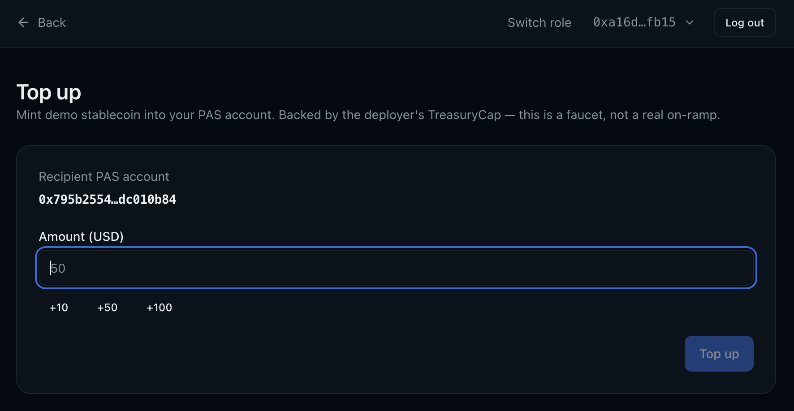
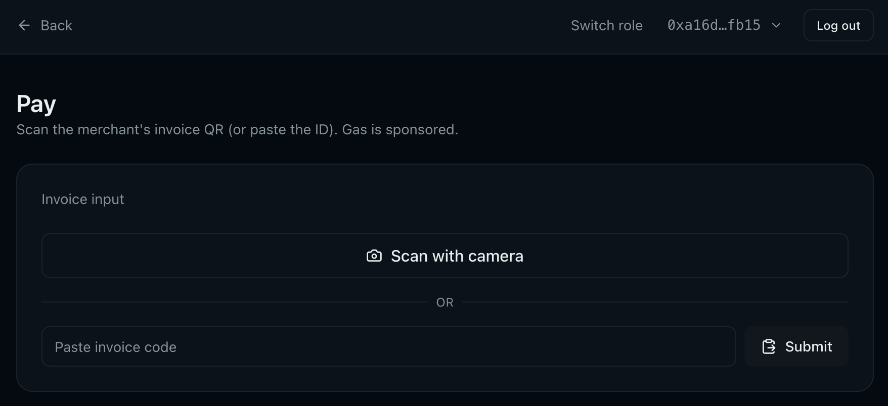
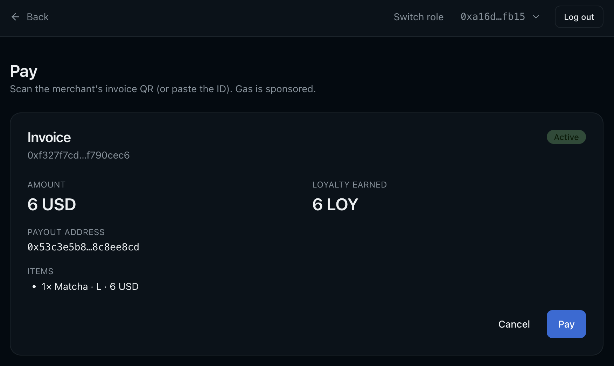
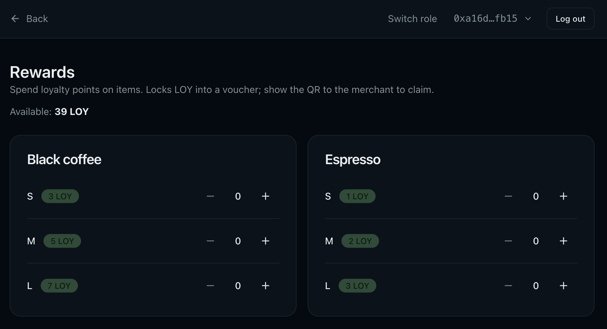
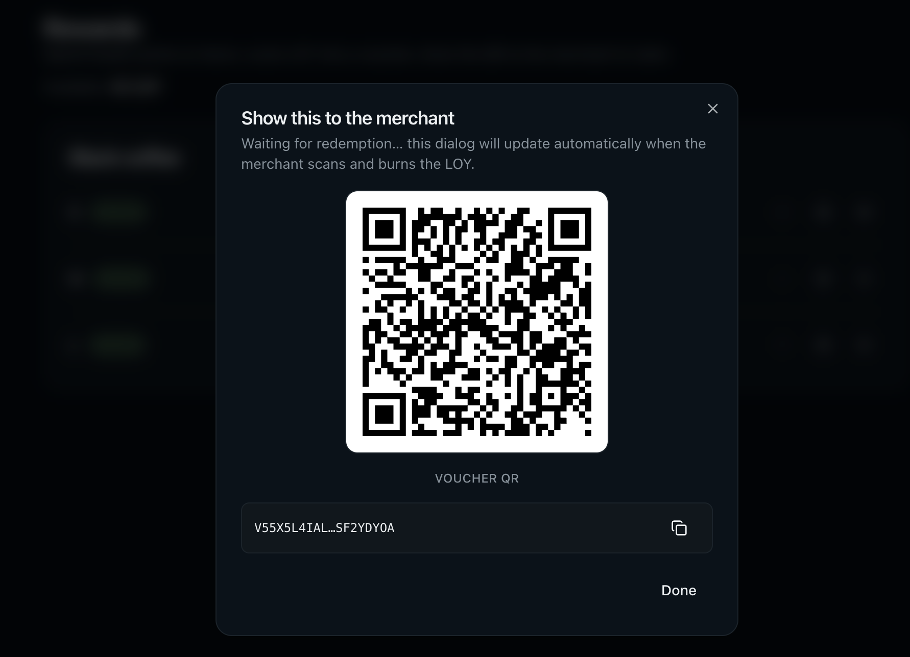
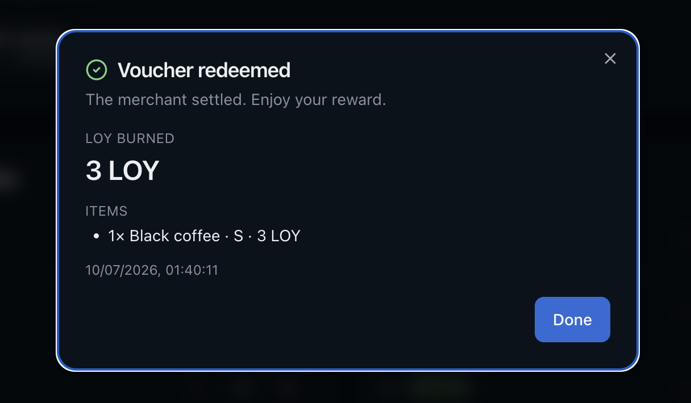
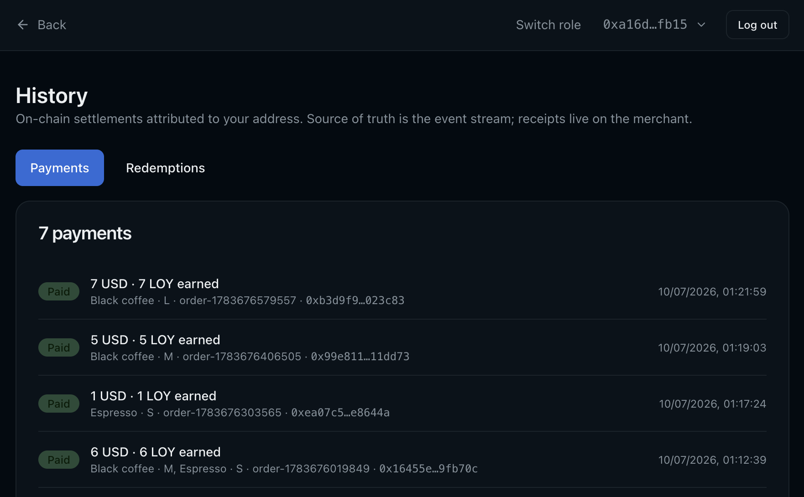

# Customer overview

A page-by-page tour of the customer side of the dApp once you've completed
the [Quickstart](../README.md#quickstart) and logged in
(see [OVERVIEW.md](OVERVIEW.md) for the landing page and login options).
Every page reads live from chain and submits PTBs through the connected
wallet (or the Enoki-registered sign-in on testnet — see
[ARCHITECTURE.md § Sponsored transactions](ARCHITECTURE.md#6-sponsored-transactions-with-a-three-way-branch)).

For the design decisions behind the on-chain contracts and the QR-driven
settlement rails, see [ARCHITECTURE.md](ARCHITECTURE.md).

## /customer — Dashboard

Landing page after login. Shows the customer's PAS-account balances
(stablecoin + `LOYALTY`) and the last few payments and redemptions
attributed to the wallet address. Quick links to the four action pages sit
directly under the balance card.

What you do here:

- **Balance** reads the customer's PAS Account directly (not owned coins on
  the wallet address). If this is the first visit, the account is
  auto-created and shows zero — top up next.
- **Recent transactions** is a client-side merge of `InvoicePaid` and
  `VoucherRedeemed` events filtered by the connected address, sorted newest
  first. See [ARCHITECTURE.md § Known limitations](ARCHITECTURE.md#per-customer-history-has-a-global-page-cap)
  for the page-cap failure mode at scale.

## /customer/topup — Top up

Mint mock-USD stablecoin directly into your PAS account. The route calls
`stablecoin_mock::faucet` under the deployer's `TreasuryCap`, so it exists
only for the demo — a mainnet deployment would swap this for a real
on/off-ramp.

What you do here:

- Enter an amount in whole/decimal USD. The client converts to base units
  (`6 decimals`) and POSTs `/api/topup`; the server signs with the deployer
  key and lands the mint into `recipientAccountId`.
- The route is disabled on mainnet — the guard returns HTTP 410 with an
  explanatory message. Testnet keeps it open, deliberately unauthenticated
  (see [ARCHITECTURE.md § Known limitations](ARCHITECTURE.md#apitopup-is-an-unauthenticated-mock-usd-faucet-on-testnet)).

## /customer/pay — Scan to pay

Settlement for merchant-issued invoices. The customer either scans the
counter's QR with their device camera, uploads a screenshot, or pastes the
invoice code — the field accepts all three. Once an invoice id is resolved,
its snapshotted terms load from `merchant.invoices[id]` and a full receipt
preview renders before the customer confirms.

What you do here:

- **Scan / upload / paste** — the invoice QR carries only the invoice id
  (the merchant is a shared object; nothing else needs to travel).
- The **Invoice** card shows the amount in USD, the LOY the customer will
  earn on settlement, the itemised line-items (looked up in the current
  catalog), and the on-chain expiry (compared against the `0x6` Clock so
  freshly issued invoices never mis-render as expired — see
  [ARCHITECTURE.md § 5](ARCHITECTURE.md#5-time-comes-from-the-on-chain-clock-not-the-wallclock)).
- **Pay** submits `merchant::pay` under a `SendUnlockApproval` on the
  customer's stablecoin PAS account. On success, the confirmation dialog
  opens.

## /customer/rewards — Rewards

Spend loyalty. The catalog renders as a menu where every variant that has a
`loyalty_price` shows a "Add to voucher" button; picking variants builds a
cart, and **Create voucher** locks the total LOY into a `Voucher` on chain
plus generates the local preimage that lets the merchant later redeem the
QR.

What you do here:

- Add variants to the cart. Each row shows both the USD price (greyed out —
  not relevant here) and the LOY price used for redemption.
- **Create voucher** locks the total LOY, commits `blake2b256(preimage)` to
  the voucher, and stores the preimage in `localStorage` keyed by the
  commitment. See [ARCHITECTURE.md § 3](ARCHITECTURE.md#3-hashlock-voucher-for-offline-scan-to-redeem)
  for the hashlock model, and
  [ARCHITECTURE.md § Known limitations](ARCHITECTURE.md#voucher-preimage-is-device-bound) for
  the device-bound-preimage limitation.
- **Open vouchers** at the top surfaces every un-redeemed voucher tied to
  the wallet. Click one to re-show its QR — the preimage stays local, so
  the QR can be re-generated any time on the same device.

The QR that the customer shows the merchant carries `{ voucher_id, preimage }`.
It's a bearer credential — anyone with the image can redeem — so show it
only at the counter and let it expire if unused.

When the merchant scans + redeems, the dialog auto-flips to the "redeemed"
view (polling `merchant.voucher_receipts[voucher_id]` at 1 s intervals). The
alternate terminal state is "canceled" — the voucher expired and someone
called `cancel_expired_voucher`, refunding the locked LOY back into the
customer's PAS account.

## /customer/history — History

Full ledger of the customer's on-chain activity, split into **Payments** and
**Redemptions** tabs. Same event-driven data source as the dashboard's
recent-transactions strip, just unpaginated within the walked window.

What you do here:

- Toggle **Payments** / **Redemptions** — same list model, different event
  source (`InvoicePaid` vs `VoucherRedeemed`).
- The list is capped at ~1000 most-recent events across all customers before
  filtering — a template deployment intended for real traffic should be
  paired with a proper indexer. Details in
  [ARCHITECTURE.md § Known limitations](ARCHITECTURE.md#per-customer-history-has-a-global-page-cap).

## Where to go next

- [OVERVIEW.md](OVERVIEW.md) — landing page, role-based routing, and the
  Google / Slush login options.
- [OVERVIEW_MERCHANT.md](OVERVIEW_MERCHANT.md) — the counter side of the
  same flows: creating invoices, scanning vouchers, and monitoring the
  transactions feed.
- [ARCHITECTURE.md](ARCHITECTURE.md) — design rationale, module layout,
  PTB flow diagram.
- [Top-level README](../README.md) — install, `pnpm bootstrap` / `pnpm seed`
  flow, env vars.
