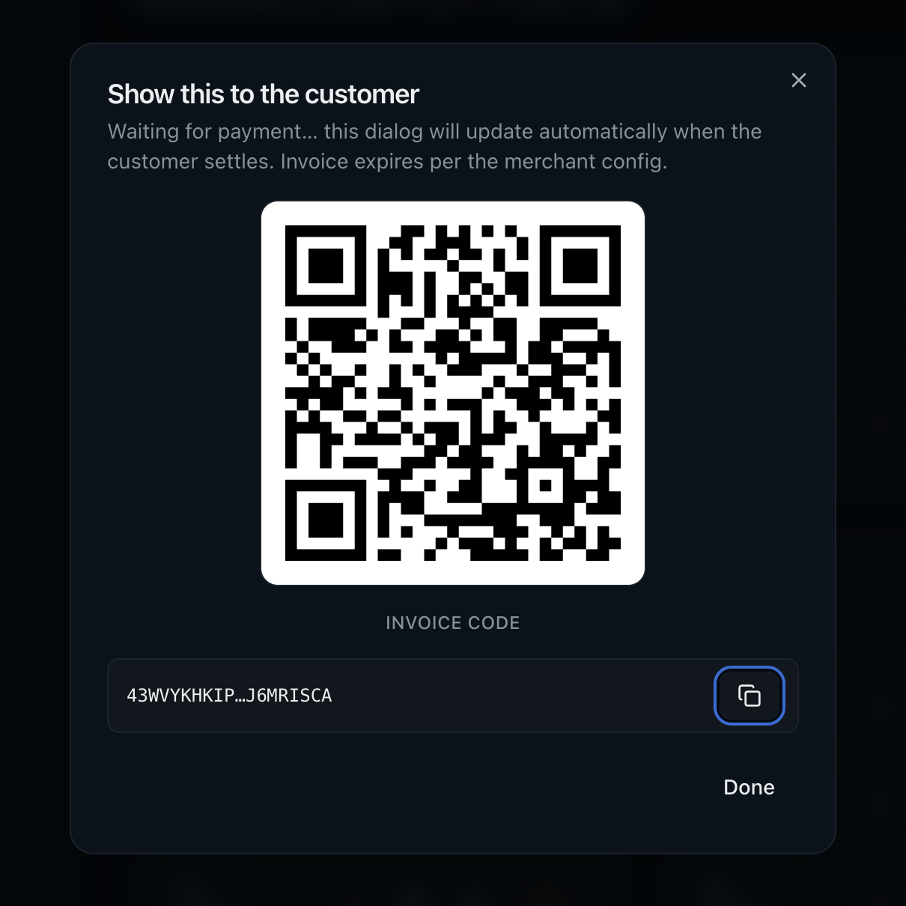
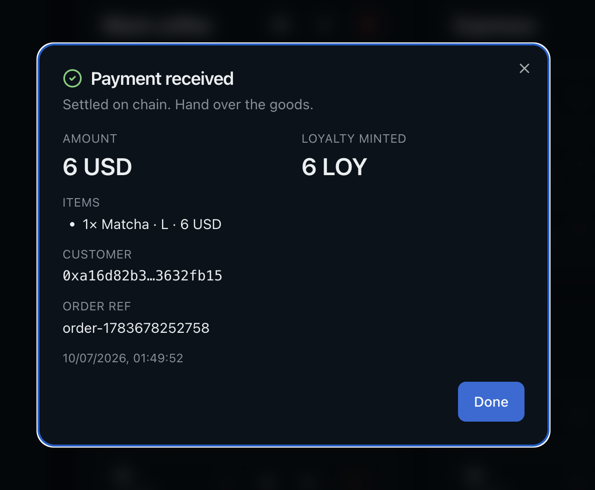
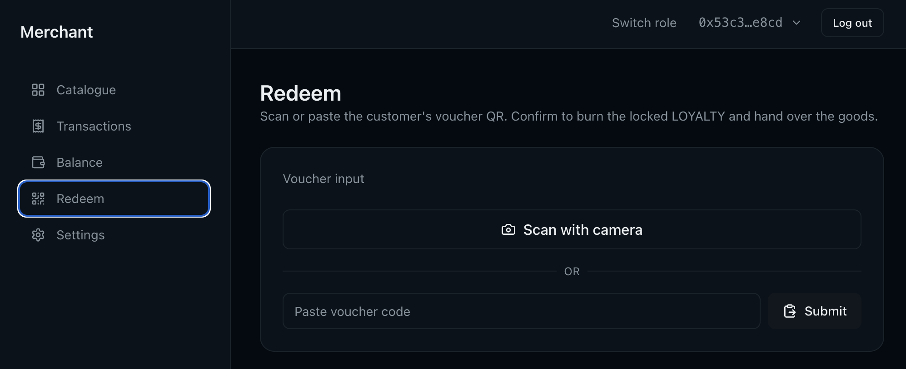
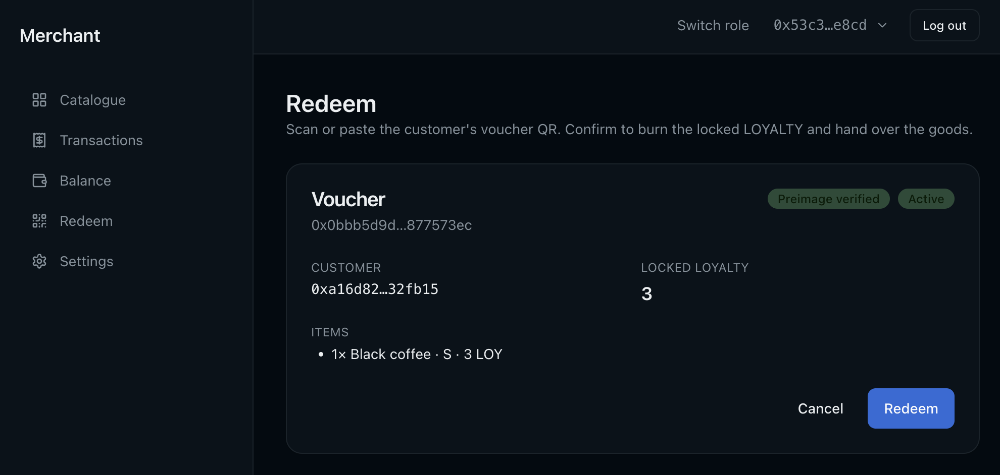
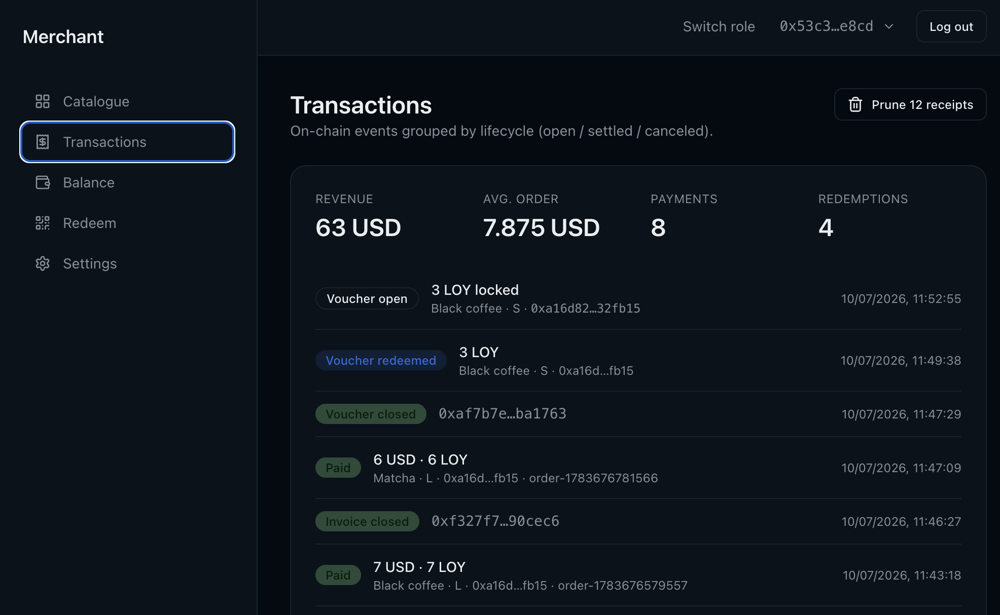
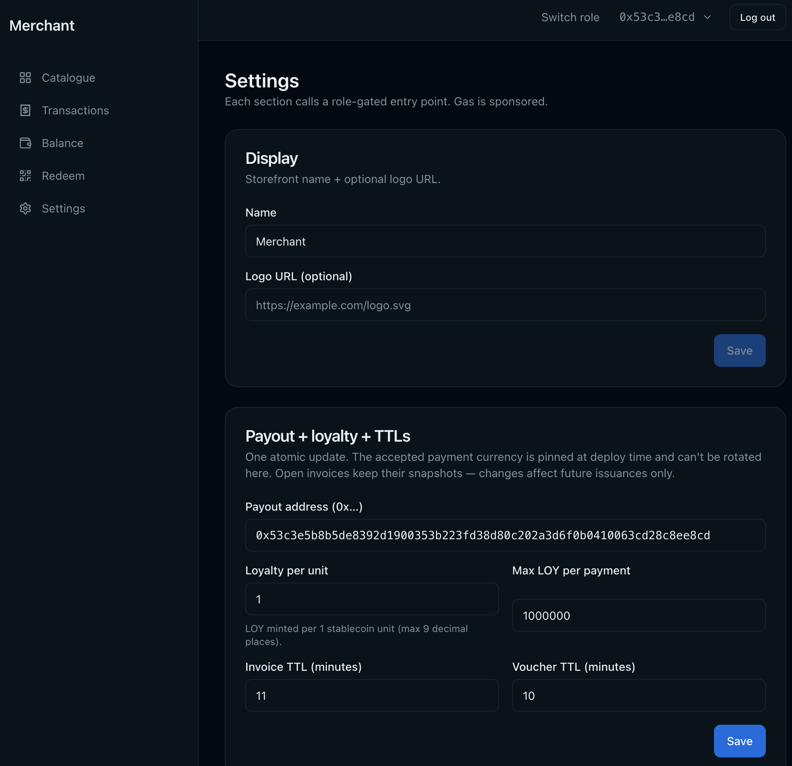
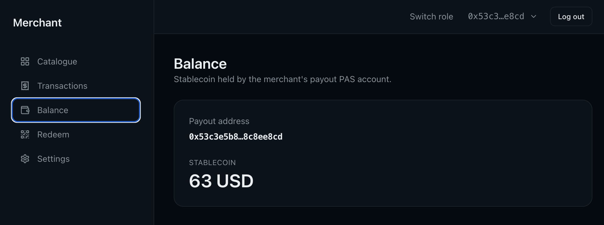

# Merchant overview

A page-by-page tour of the merchant side of the dApp once you've completed
the [Quickstart](../README.md#quickstart), logged in
(see [OVERVIEW.md](OVERVIEW.md) for the landing page and login options),
and been granted `CashierRole` / `CatalogManagerRole` / `MerchantRole` on
the `AccessControl<MERCHANT>` object - the deployer holds all three after
`pnpm bootstrap`, and any of the three routes the landing page straight
into `/merchant/catalogue`. Every page reads live from chain and submits
PTBs through the connected wallet.

For the design decisions behind the on-chain contracts and the role split,
see [ARCHITECTURE.md § 4](ARCHITECTURE.md#4-access-control-roles-gate-the-admin-surface).

## /merchant/catalogue - Catalogue

The counter. Every listing (`Espresso`, `Black coffee`, …) renders as a card
with its variants (S / M / L, each carrying a USD price and an optional LOY
price). The cashier picks variants into a cart, adds an optional order ref,
and clicks **Create invoice** to mint an on-chain `Invoice` and open its QR
in a dialog.

What you do here:

- **Add items to cart** - each add stamps the current variant price into
  the cart line. The invoice, once created, snapshots those prices onto
  chain - a later catalog edit doesn't retroactively change what the
  customer will pay.
- **Order ref** is an opaque string the counter can use to correlate the
  on-chain invoice with a POS ticket. Stored on the invoice, surfaced back
  in the customer's history and in `/merchant/transactions`.
- **Create invoice** submits `merchant::create_invoice` under
  `CashierRole` (via `access_control::new_auth`). The QR dialog opens
  immediately with the invoice code; it polls
  `merchant.invoice_receipts[invoice_id]` at 1 s intervals to detect
  settlement.

The three terminal states are:

- **Paid** - a `Receipt<Payment>` landed in the merchant's receipts table.
  Dialog auto-flips to the confirmation view with the customer, itemised
  amount, LOY minted, order ref, and settlement timestamp.
- **Canceled** - no receipt arrived and the invoice is gone from
  `merchant.invoices` (someone called `cancel_expired_invoice` after
  expiry). Dialog shows a "canceled" notice.
- **Still open** - invoice not paid, not expired; the QR stays on screen
  and the cashier hands the customer the goods only after the paid state
  arrives.

## /merchant/redeem - Redeem

Loyalty settlement. The cashier scans / uploads / pastes the customer's
voucher QR (which carries `{ voucher_id, preimage }`), the client optionally
hash-checks the preimage against `voucher.redeem_hash`, and **Redeem** submits
`merchant::redeem` - on chain, the contract recomputes the hash and burns
the locked `Balance<LOYALTY>` on match.

What you do here:

- **Preimage badge** - green "Preimage verified" if the scanned preimage
  hashes to the voucher's committed `redeem_hash`, red "Wrong preimage" if
  not. The chain enforces this regardless, but the local pre-check saves a
  failed gas spend on a bad scan.
- **Expiry** compares against the `0x6` Clock (see
  [ARCHITECTURE.md § 5](ARCHITECTURE.md#5-time-comes-from-the-on-chain-clock-not-the-wallclock)).
  Expired vouchers can only be cleaned up via `cancel_expired_voucher`
  (permissionless - the customer usually does it themselves to reclaim the
  locked LOY).
- **Redeem** submits `merchant::redeem` under `CashierRole` (via
  `access_control::new_auth`) and additionally requires the scanned preimage -
  the chain enforces both, so `CashierRole` alone can't sweep vouchers (see
  [ARCHITECTURE.md § 3](ARCHITECTURE.md#3-hashlock-voucher-for-offline-scan-to-redeem)).

## /merchant/transactions - Transactions

Unified event feed for the counter. Every settled invoice
(`InvoicePaid`) and every burned voucher (`VoucherRedeemed`) shows up here,
along with open-but-unsettled invoices and vouchers, plus a "Prune settled
receipts" button that reclaims storage rebate for finalised receipts (the
canonical record stays in the events).

What you do here:

- **Filter tabs** narrow the list - `Paid`, `Redeemed`, and `Canceled`
  are terminal states from the event stream; `Open` merges live
  `merchant.invoices` + `merchant.vouchers` for anything not yet settled.
- **Expand** any row to see the itemised breakdown (`Listing · Variant`
  looked up in the current catalog, with quantity and per-line price).
- **Cancel expired** - permissionless clean-up of an expired invoice or
  voucher. Refunds the voucher's locked LOY back into the customer's PAS
  account; frees the receipts-table slot on the merchant.
- **Prune settled receipts** - `MerchantRole`-gated. Deletes finalised
  `Receipt<Payment>` / `Receipt<Redemption>` values keyed by invoice /
  voucher id, reclaiming the storage rebate. The event log is the
  canonical history - this only removes the lookup-value.

## /merchant/settings - Settings

Two grouped forms: **Display** (storefront name + logo URL, purely UI
metadata) and **Payout + loyalty + TTLs** (the on-chain `Config` bound to
future invoices).

What you do here:

- **Display** submits `merchant::update_display` under `MerchantRole` -
  cosmetic only, doesn't affect settlement.
- **Payout + loyalty + TTLs** submits `merchant::update_config` under
  `MerchantRole`. The new values bind **future** invoices only -
  outstanding invoices settle against their snapshotted terms (see
  [payment.move: snapshot semantics](../contracts/payments/sources/payment.move)).
- **Loyalty coefficient** is a decimal (`1.0` = 1 LOY per $1). Under the
  hood it's stored as `coefficient × 1e9` and applied per invoice as
  `(payment_units × coefficient) / (1e9 × 10^payment_decimals)`, capped at
  `max_loyalty_per_payment`.

## /merchant/balance - Balance

Payout-side view. Shows the balance in the payout PAS account (where every
settled invoice's stablecoin lands) plus a small internal-transfer form for
moving stablecoin between the merchant's account and the payout account -
useful when the payout address is a treasury multisig and the counter needs
working capital elsewhere.

What you do here:

- The payout address is set on `/merchant/settings` and is what
  `create_invoice` snapshots onto every invoice's `payout_address` field.
  Rotating it here (via `update_config`) affects only future invoices.
- **Transfer** issues a `namespace::send_funds` call between the merchant's
  PAS account and the payout PAS account, gated by the stablecoin policy's
  `TransferApproval` on the source account.

## Where to go next

- [OVERVIEW.md](OVERVIEW.md) - landing page, role-based routing, and the
  Google / Slush login options.
- [OVERVIEW_CUSTOMER.md](OVERVIEW_CUSTOMER.md) - the customer side of the
  same flows: scanning invoices to pay, creating vouchers to redeem.
- [ARCHITECTURE.md](ARCHITECTURE.md) - design rationale, module layout,
  PTB flow diagram.
- [Top-level README](../README.md) - install, `pnpm bootstrap` / `pnpm seed`
  flow, env vars.
